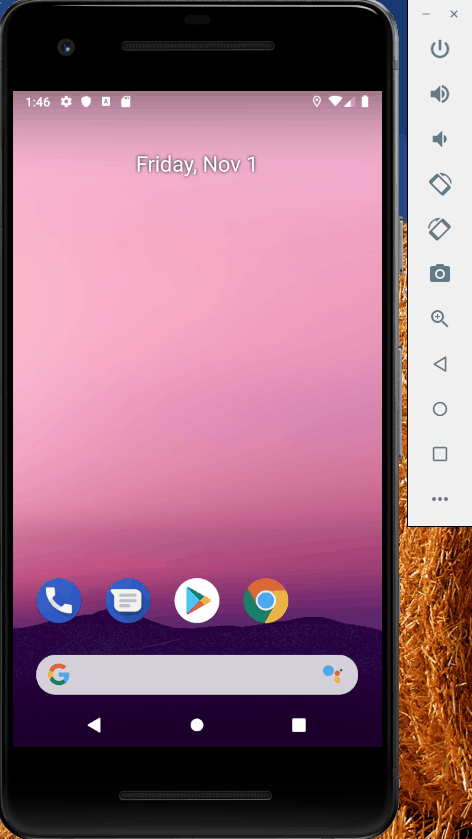

# Sleep Tracker

An Android application that tracks the user's sleep quality.

Submitted by: Tanner Iverson

Time spent: 3 hours

## User Stories

The following **required** functionality is complete:

* [X] Create entity using Room annotations.
* [X] Create Data Access Object (DAO) interface.
* [X] Add SQL queries to Data Access Object (DAO).
* [X] Create a Room database.
* [X] Add ViewModel.
* [X] Implement coroutines to separate main/UI thread from other operations.
* [X] Add navigation and ability to record sleep quality.
* [X] Implement button states to prevent incorrect user choice.
* [X] Add Snackbar message indicating the clearing of all data from the database.

The following **additional** features are implemented:

* [X] List anything else that you can get done to improve the app functionality!

## Video Walkthrough 

Here's a walkthrough of implemented user stories:

## Notes

Additional app functionality: option to edit previous sleep qualities, search bar to search
for specific sleep dates, option to change 24 hour dates to 12 hour AM-PM dates

## License

Copyright 2019 Tanner Iverson

Licensed under the Apache License, Version 2.0 (the "License");
you may not use this file except in compliance with the License.
You may obtain a copy of the License at

http://www.apache.org/licenses/LICENSE-2.0

Unless required by applicable law or agreed to in writing, software
distributed under the License is distributed on an "AS IS" BASIS,
WITHOUT WARRANTIES OR CONDITIONS OF ANY KIND, either express or implied.
See the License for the specific language governing permissions and
limitations under the License.
